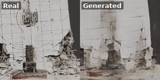

# 3D Damage Visualization — RC Bridge Columns (GRAF)

**Live demo: [https://marcelab.caece.net/3D-results/](https://marcelab.caece.net/3D-results/)**

Supplementary material for:

> **3D Damage Prediction for RC Bridge Columns via Physics-Informed Generative Radiance Fields**
> Chia-Yu Chou, Rih-Teng Wu
> Department of Civil Engineering, National Taiwan University
> Submitted to *Engineering Structures*

This repository hosts 360° rotating visualizations of real vs. GRAF-generated
RC bridge column damage that could not be included as static figures in the
manuscript (PDF does not support embedded video/GIF).

## Live page

The full interactive gallery (higher-quality MP4, side-by-side layout) is
live at:

```
https://marcelab.caece.net/3D-results/
```

The animated previews below are lower-resolution GIFs for quick viewing
directly on GitHub; see the live page above for full quality.

## Preview

**Fold 2** configuration — trained on RS307, RS330, RS615; evaluated on
held-out specimen **RS315**. The GIF below shows the held-out test specimen
(real on the left, generated on the right, composited into a single file so
the two rotations stay frame-synchronized). The three training-specimen
reconstructions (RS307, RS330, RS615) are available on the
[live page](https://marcelab.caece.net/3D-results/).



## Contents

- `index.html` — visualization gallery (real vs. generated, 360° rotation)
- `assets/` — MP4 videos (256×256 per pane, 25 fps, 72 frames covering
  0°–360°); each `rsXXX_combined.mp4` composites the real capture and
  generated result side-by-side into a single frame-synchronized file
- `gifs/` — a composited real-vs-generated GIF preview (RS315, side-by-side
  in a single file to keep the two rotations frame-synchronized) for
  embedding in this README

The videos shown correspond to the **Fold 2** cross-validation configuration
(trained on RS307, RS330, RS615; evaluated on held-out specimen RS315), as
defined in Table 5 of the manuscript.

## License

Add a license file appropriate for your lab's data-sharing policy before
making this repository public (e.g. CC-BY-4.0 for the visualizations).
